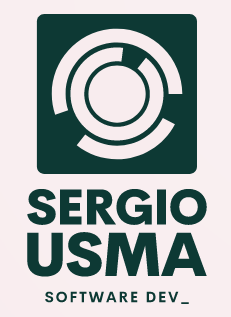

<a name="readme-top"></a>

<div align="center">

  <h1><b>Rails 7 Group Project - Recipe App</b></h1>

  
  <br/>

</div>

## 📗 Table of Contents

- [📖 About the Project](#about-project)
- [🛠 Built With](#built-with)
- [Key Features](#key-features)
- [Future Features](#future-features)
- [💻 Getting Started](#getting-started)
- [Setup](#setup)
- [Prerequisites](#prerequisites)
- [Usage](#usage)
- [👥 Authors](#authors)
- [🤝 Contributing](#contributing)
- [⭐️ Show Your Support](#support)
- [📜 License](#license)

## 📖 About the Project <a name="about-project"></a>

Recipe app is a Ruby on Rails 7 application that allows users to create, edit, and share recipes. Users can also create shopping lists based on the ingredients in their recipes and the items they have in their inventory. The app is designed to be user-friendly and intuitive, with a responsive web design that adapts to different screen sizes and devices.

## 🛠 Built With <a name="built-with"></a>

This project is built using Ruby on Rails, a robust web framework known for its simplicity and efficiency. Ruby on Rails provides a solid foundation for creating dynamic and user-friendly web applications.

##  Key Features <a name="key-features"></a>

- **User-friendly interface for seamless recipe management.**
- **Ingredient tracking and inventory management system.**
- **Recipe creation, editing, and deletion capabilities.**
- **Shopping list generation based on available ingredients and missing items.**
- **Public and private recipe options for sharing and privacy.**
- **Responsive web design for optimal user experience.**
- **Comprehensive error handling and validation.**

## 🔭 Future Features <a name="future-features"></a>

- [ ] Advanced search functionality for finding specific recipes and ingredients.
- [ ] User profiles with customizable avatars and preferences.
- [ ] Integration with external APIs for ingredient information and recipe suggestions.
- [ ] Meal planning features, including weekly menus and scheduling.
- [ ] User ratings and reviews for shared recipes.
- [ ] Social media sharing options for recipes and cooking experiences.

## 💻 Getting Started <a name="getting-started"></a>

To get started with the Recipe App, follow the instructions below:

### 🛠 Setup <a name="setup"></a>

1. Clone the project repository:

   ```bash
   git clone git@github.com:sergio-usma/recipes_app.git
    ```
2. Navigate to the project folder:
   ```bash
   cd recipes_app
   ```
### Prerequisites <a name="prerequisites"></a>
Before you can run the Blog App, make sure you have the following prerequisites and configurations in place:

- **Ruby**: Ensure that Ruby is installed on your machine. You can check if it's installed by running `ruby -v` in your terminal. If it's not installed, you can download and install it from the [official Ruby website](https://www.ruby-lang.org/en/documentation/installation/).

- **Ruby on Rails**: You'll need the Ruby on Rails framework installed. If you don't have it yet, you can install it using the following command:
  ```
  gem install rails
  ```

- **Code Editor**: You should have a code editor like Visual Studio Code (VSCode) installed. You can download VSCode from the [official website](https://code.visualstudio.com/).

- **Git**: Git is essential for version control. Make sure you have Git installed and configured on your system. You can download Git from the [official Git website](https://git-scm.com/downloads).

- **PostgreSQL**: Ensure that PostgreSQL is installed and properly configured on the server where you are developing the project. This project assumes the use of PostgreSQL as the default database. You can download PostgreSQL from the [official PostgreSQL website](https://www.postgresql.org/download/).

- **Ruby on Rails Configuration**: Make sure your Ruby on Rails project is configured to use PostgreSQL as the default database.

With these prerequisites and configurations in place, you'll be ready to set up and run the Blog App.

### 📖 Usage <a name="usage"></a>
Follow these steps to use the Blog App:

Open your terminal.

Navigate to the directory where the project files are located:

Copy code
```bash
cd /path/to/your/project/files
```
Start the Rails server:

Copy code
```bash
rails server
```
Open your web browser and go to http://localhost:3000 to access the Blog App.

## 👥 Authors <a name="authors"></a>

👤 **Sergio Usma**

- GitHub: [@sergio-usma](https://github.com/sergio-usma)
- Twitter: [@VonUsma](https://twitter.com/vonusma)
- LinkedIn: [Sergio Andres Usma](https://www.linkedin.com/in/sergiousma/)

👤 **Gumaro Monroy Vazquez**
- GitHub: [GitHub](https://github.com/Movgto)
- LinkedIn: [LinkedIn](https://www.linkedin.com/in/gumaro-monroy-vazquez-1705aa165/)
- WellFound: [Wellfound](https://wellfound.com/u/maro-monroy)

## 🤝 Contributing <a name="contributing"></a>

Contributions, issues, and feature requests are welcome!
Feel free to check the [issues page](https://github.com/sergio-usma/recipes_app/issues) and contribute to the project.

## ⭐️ Show Your Support <a name="support"></a>
If you like this project, please consider supporting us! Your support helps us to continue developing and improving our project for everyone to enjoy. Whether it's a small donation, sharing the project with your friends, or contributing your skills and expertise, every little bit makes a huge difference. With your support, we can create something truly amazing together. Thank you for being a part of our community and helping us to make a difference!

## 🙏 Acknowledgments <a name="acknowledgements"></a>

I would like to express my heartfelt gratitude to [Microverse](https://github.com/microverseinc) for providing us with the opportunityto work on this project. and I would like to extend my appreciation to my fellow contributors who have played a significant role in making this project a successful. their dedication and collaboration have been invaluable.
<p align="right">(<a href="#readme-top">back to top</a>)</p>

## 📜 License <a name="license"></a>
This project is [MIT](https://github.com/sergio-usma/recipes_app/dev/LICENSE) licensed.